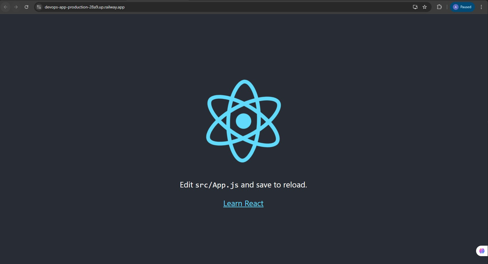
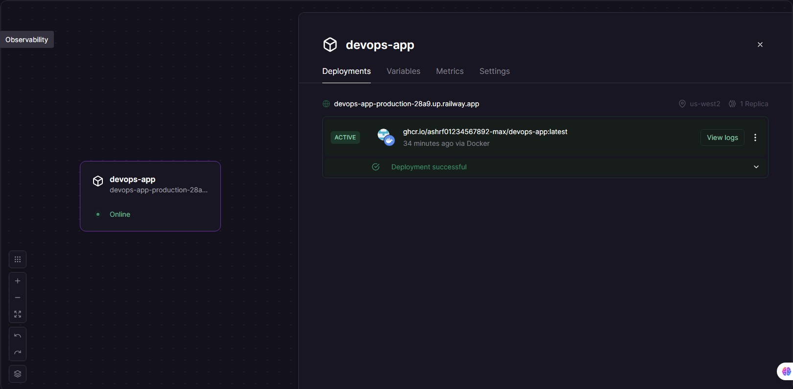
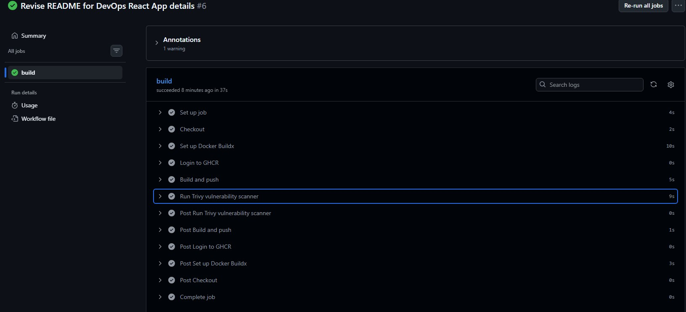

# DevOps React Portfolio App

A simple React application containerized with Docker (multi-stage build), equipped with automated CI/CD using GitHub Actions, security scanning via Trivy, and deployed live on Railway.

## Live Demo (Running Now)
🚀 **Direct link to the live application:**  
https://devops-app-production-28a9.up.railway.app/

## Project Highlights
- **Frontend**: React (Create React App)
- **Containerization**: Multi-stage Docker build  
  → Build stage: Node 22 slim  
  → Production stage: Nginx stable-alpine
- **Web Server**: Nginx with custom configuration to support React Router (SPA routing via `try_files`)
- **CI/CD**: GitHub Actions  
  → Builds Docker image on every push to `main`  
  → Scans image with Trivy (vulnerability scanner)  
  → Pushes image to GitHub Container Registry (GHCR)
- **Deployment**: Railway.app (free tier) – automatic public domain
- **Security**: Trivy integrated into the pipeline (scan results visible in logs)

## Screenshots

### Live Application


### Railway Deployment – Active & Online


### GitHub Actions – Successful Run (with Trivy)


### Trivy Scan Results (latest run)
![Trivy Scan Output]   Library    ,CVE ID           ,Severity   ,Installed Version   ,Fixed Version   ,Vulnerability Summary
                       libexpat   ,CVE-2026-32767   ,CRITICAL   ,2.7.4-r0            ,2.7.5-r0        ,Authorization Bypass 
                       libexpat   ,CVE-2026-32777   ,MEDIUM     ,-                   ,-               ,DoS via infinite loop in DTD parsing
                       libexpat   ,CVE-2026-32778   ,MEDIUM     ,-                   ,-               ,DoS via NULL pointer after OOM
                       zlib       ,CVE-2026-22184   ,HIGH       ,1.3.1-r2            ,1.3.2-r0        ,Arbitrary code execution via buffer overflow
                       zlib       ,CVE-2026-27171   ,MEDIUM     ,-                   ,-               ,DoS via infinite loop in CRC32

## Architecture Overview
GitHub Push → GitHub Actions
↓
Build Docker Image
↓
Trivy Vulnerability Scan
↓
Push Image to GHCR
↓
Railway pulls latest image
↓
Public URL generated
↓
Live React App

## How to Run Locally

```bash
# 1. Clone the repo
git clone https://github.com/ashrf01234567892-max/devops-project.git
cd devops-project

# 2. Build the Docker image
docker build -t devops-app .

# 3. Run the container
docker run -d -p 8080:80 --name devops-app devops-app

# 4. Open in browser
http://localhost:8080
```
CI/CD Pipeline (GitHub Actions)

Workflow file: .github/workflows/docker-build-push.yml
Triggers: every push to main
Steps:
Checkout code
Set up Docker Buildx
Login to GHCR
Build & push multi-arch image
Run Trivy scanner (shows vulnerabilities in logs)

Status: 

Security Scan (Trivy)
Latest scan results (from GitHub Actions):

Total vulnerabilities: 5
Critical: 1
High: 1
Medium: 3

Most are in Alpine base image packages (libexpat & zlib)
Typical for production Alpine images in 2026 – not critical for static SPA serving

Technologies Stack

React 19
Docker (multi-stage)
Nginx (custom SPA routing)
GitHub Actions
Trivy (vulnerability scanning)
Railway.app (hosting & auto-domain)

Lessons Learned

Multi-stage Docker builds reduce image size dramatically (~94 MB compressed)
Custom nginx.conf is essential for React Router to handle refresh correctly
Trivy integration in CI is easy and adds real DevSecOps value
Railway makes deployment dead-simple with Docker images (no YAML needed)

Future Improvements (Roadmap)

Add auto-deploy from GitHub Actions to Railway via webhook
Add custom domain
Add basic monitoring (Railway metrics + external uptime check)
Migrate to Kubernetes (local minikube or kind)


تواصل معي

GitHub: https://github.com/ashrf01234567892-max
